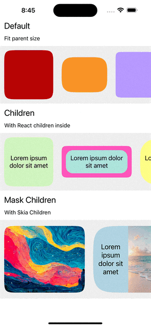

# react-native-squircle

A performant React-Native component for Squircle shapes with configurable options

<div align="center">
  
</div>

## Installation

```sh
npm install react-native-squircle

or 

yarn add react-native-squircle
```

For expo:

```sh
npx expo install react-native-squircle
```

## Example

<div align="center">
  
</div>


## Usage

```js
import Squircle from 'react-native-squircle';

// ...

const MyComponent = () => {
  return (
    <View style={styles.container}>
        <Squircle 
            borderRadius={20} 
            backgroundColor="#B70404"
        />
    </View>
  );
};
```

### Draw a Squircle inside a Squircle:

```js
import Squircle, { drawSquirclePath } from 'react-native-squircle';

const WIDTH = 200;
const HEIGHT = 180;
const BORDER = 6;
const BORDER_RADIUS = 30;
const SMOOTHING = 1;

// ...

const MyComponent = () => {

  // Compute your inside Squircle path
  const insidePath = useMemo(() => {
    return drawSquirclePath({
      borderSmoothing: SMOOTHING,
      borderRadius: BORDER_RADIUS - BORDER,
      width: WIDTH - BORDER * 2,
      height: HEIGHT - BORDER * 2,
    });
  }, []);

  return (
    <View style={styles.container}>
      <Squircle
        style={styleSheetSize(WIDTH, HEIGHT)}
        borderRadius={BORDER_RADIUS}
        maskChildren={<Fill color="#B70404" />}
        skiaChildren={
          <Group>
            <Offset x={BORDER} y={BORDER} />
            <Path path={insidePath} color={'#AFD3E2'} />
          </Group>
        }
      />
    </View>
  );
};
```

<div align="center">
  
</div>

The `Squircle` component take these following props:

<table>
  <tr>
    <th>Name</th>
    <th>Type</th>
    <th>Explanation</th>
    <th>Required</th>
    <th>Default Value</th>
  </td>
  <tr>
    <td><code>borderRadius</code></td>
    <td><code>number</code></td>
    <td>The radius of the squircle.</td>
    <td>❌</td>
    <td><code>16</code></td>
  </tr>
   <tr>
    <td><code>backgroundColor</code></td>
    <td><code>string | Float32Array | number</code></td>
    <td>The background color of the squircle.</td>
    <td>❌</td>
    <td><code>#FFFFFF</code></td>
  </tr>
  <tr>
    <td><code>borderSmoothing</code></td>
    <td><code>number</code></td>
    <td>The higher the value, the smoother the border (between 0 and 1).</td>
    <td>❌</td>
    <td><code>1</code></td>
  </tr>
  <tr>
    <td><code>children</code></td>
    <td><code>React.ReactNode | React.ReactNode[]<code></td>
    <td>React children.</td>
    <td>❌</td>
    <td><code>undefined</code></td>
  </tr>
  <tr>
    <td><code>maskChildren</code></td>
    <td><code>React.ReactNode | React.ReactNode[]<code></td>
    <td>Skia node that will be masked by the squircle.</td>
    <td>❌</td>
    <td><code>undefined</code></td>
  </tr>
  <tr>
    <td><code>skiaChildren</code></td>
    <td><code>React.ReactNode | React.ReactNode[]<code></td>
    <td>Skia node that will be draw inside the Skia Canvas.</td>
    <td>❌</td>
    <td><code>undefined</code></td>
  </tr>
  <tr>
    <td><code>style</code></td>
    <td><code>StyleProp<ViewStyle><code></td>
    <td>Style for the container component.</td>
    <td>❌</td>
    <td><code>undefined</code></td>
  </tr>
</table>

## Contributing

Feel free to contribute by creating a PR.

## License

MIT

---

Based on [react-native-figma-squircle](https://github.com/phamfoo/react-native-figma-squircle/blob/main/src/index.tsx)

Made with [create-react-native-library](https://github.com/callstack/react-native-builder-bob)
Made with [Skia](https://github.com/shopify/react-native-skia)
